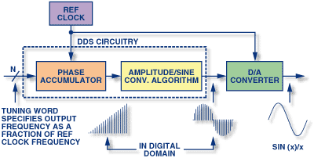

# Polyphonic piano waveform generation

This document describes the algorithm used to generate piano waveform using software-realized Direct Digital Synthesis (DDS).

## Direct Digital Synthesis (DDS)

Direct digital synthesis (DDS) is a method of producing an analog waveform, usually a sine wave—by generating a time-varying signal in digital form and then performing a digital-to-analog conversion.

  

The image above [1] shows the block diagram of a DDS system.

One of the key parts of this system is the *phase accumulator*.
The phase accumulator is actually an upcounting counter that generates the phase of the signal.
In case of sine wave, mathematically represented by $\sin(x)$, the phase accumulator is actually holding $x$.
The unique thing about this counter is that its increment value can be changed, thus allowing different frequencies for the generated waveform.

The second block, called *amplitude conversion algorithm* uses or modifies the phase accumulator value to generate a digital word that will be converted to analog signal using DAC.
For example, if we want to generate a square wave, we can use only the MSb of the phase accumulator.
If the goal waveform is triangular wave, and the DAC has resolution of 16 bits, we can use the more significant 16 bits of the phase accumulator as input for the DAC.
Non-linear waveforms can be generated by using the phase accumulator output to address a Look-up Table (LUT).

### DDS software implementation

To realize a DDS system in software, the following approach can be used:
1. The phase accumulator can be realized with a variable that is incremented by a given value which is dependent on the output waveform frequency.
2. The amplitude conversion algorithm can be simple as isolating few bits from the phase accumulator.
3. The reference clock can be achieved by incrementing it in a predefined time interval, i.e. with timer interrupt.

The DAC part must be realized by some kind of hardware.
If the target device does not have a dedicated DAC peripheral, it is possible to realize DAC using PWM and low-pass filter.
The DAC resolution in this case is the PWM duty cycle resolution.
The samples should be outputed at the reference clock period.
If PWM + filter is used as DAC, the PWM frequency should be well above the required output sample rate, i.e. 10 times greater than the output sample rate, to avoid aliasing issues.

### Mixing multiple waveforms

To generate multiple waveforms, different sets of phase accumulators and increment values should be used, following the same principle as above.
Then, it is possible to mix multiple waveforms by two means:
1. Summing the outputs of the amplitude conversion algorithms for each channel together.
2. The inputs for the DAC should be given at a frequency n-times greater than the wanted mixed-waveform output sample rate, where n is the number of channels.
For example, if the mixed waveform output sample rate should be 20 kHz and the number of channels (different waveforms to be mixed) is 4, the inputs for the DAC should be given at a rate of 4*20 = 80 kHz.

## References
1. [Ask The Application Engineer—33: All About Direct Digital Synthesis](https://www.analog.com/en/analog-dialogue/articles/all-about-direct-digital-synthesis.html)
2. [DDS Devices Generate High-Quality Waveforms Simply, Efficiently, and Flexibly](https://www.analog.com/en/analog-dialogue/articles/dds-generates-high-quality-waveforms-efficiently.html)
3. [Waveform Generation using an ATtiny85](http://www.technoblogy.com/show?QVN)